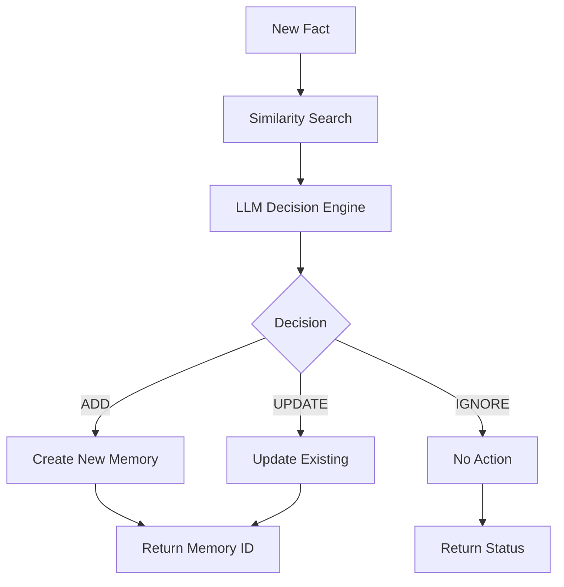

# 🧠 Memory System: Persistent AI Memory Architecture

**Building AI Systems That Actually Remember**

The Memory System is A-Modular-Kingdom's solution to the fundamental problem of AI memory: how do you give AI agents persistent, intelligent memory that goes beyond simple conversation history? Our system combines vector storage with LLM-based reasoning to create truly intelligent memory management.

## 🎯 System Overview

The memory system provides persistent storage and retrieval of information using **ChromaDB** and intelligent fact processing through **LLM-based decision making**. Unlike simple storage systems, our memory actively processes, deduplicates, and organizes information for optimal retrieval.

## 🏗️ Architecture Deep Dive

### Core Components

**`core.py`** - Contains the `Mem0` class that handles all memory operations:
- **ChromaDB integration** for vector storage
- **LLM-based fact processing** and deduplication
- **Semantic search** and retrieval
- **Memory management** (add, update, delete, search)

### Key Features

#### 1. **Intelligent Fact Processing**
   - Uses LLM to decide whether to **ADD** new memories or **UPDATE** existing ones
   - Prevents duplicate storage through similarity analysis
   - Automatic fact extraction and refinement

#### 2. **Vector Storage**
   - **ChromaDB backend** for semantic similarity search
   - **Persistent storage** in configurable directory
   - **UUID-based** memory identification

#### 3. **LLM Integration**
   - Uses `qwen3:8b` model for memory processing decisions
   - **Contextual understanding** of fact relationships
   - **Smart memory consolidation**

## 🔧 Technical Implementation

### The `Mem0` Class Architecture

```python
class Mem0:
    def __init__(self, chroma_path: str):
        self.chroma_path = chroma_path
        self.collection_name = "agent_memories"
        self.LLM_MODEL = "qwen3:8b"
    
    def add(self, fact: str) -> dict:
        """Add new information with intelligent processing"""
        
    def search(self, query: str, k: int = 3) -> List[dict]:
        """Search memories by semantic similarity"""
        
    def get_all_memories(self) -> List[dict]:
        """Retrieve all stored memories"""
        
    def delete_memory(self, memory_id: str) -> dict:
        """Remove specific memory by ID"""
```

### Intelligent Memory Processing

The heart of the system is the **LLM-based decision engine**:

```python
def _decide_memory_operation(self, fact, similar_memories):
    """
    LLM analyzes new facts against existing memories to decide:
    - ADD: Completely new information
    - UPDATE: Enhancement of existing memory
    - IGNORE: Redundant information
    """
    
    prompt = f"""
    Analyze this new fact: "{fact}"
    
    Against existing memories:
    {self._format_memories(similar_memories)}
    
    Decision options:
    - ADD: If this is genuinely new information
    - UPDATE: If this enhances/corrects existing memory
    - IGNORE: If this is redundant
    
    Respond in JSON format with your decision and reasoning.
    """
    
    response = ollama.chat(model=self.LLM_MODEL, messages=[
        {'role': 'user', 'content': prompt}
    ])
    
    return self._parse_decision(response)
```

### Vector Search Implementation

```python
def search(self, query: str, k: int = 3) -> List[dict]:
    """
    Semantic search across all memories using ChromaDB
    """
    client, collection = self._get_client_and_collection()
    
    results = collection.query(
        query_texts=[query],
        n_results=k,
        include=["documents", "metadatas", "distances"]
    )
    
    return self._format_search_results(results)
```

## 📊 Memory Operations Flow

### Adding New Information

1. **Input Processing**: New fact is received
2. **Similarity Search**: Find related existing memories
3. **LLM Analysis**: Decide ADD/UPDATE/IGNORE based on context
4. **Operation Execution**: Perform database operation
5. **Response**: Return operation status and memory ID



### Memory Retrieval

1. **Query Processing**: Convert natural language query
2. **Vector Search**: Semantic similarity in ChromaDB
3. **Result Ranking**: Distance-based relevance scoring
4. **Context Formatting**: Prepare results for consumption

## 🚀 Usage Examples

### Basic Memory Operations

```python
from memory.core import Mem0

# Initialize memory system
memory = Mem0(chroma_path="./memory_db")

# Add information (intelligent processing)
result = memory.add("The user prefers Python over JavaScript")
# Returns: {"status": "ADD", "memory_id": "uuid-here"}

# Add related information (will likely UPDATE)
result = memory.add("User's favorite Python framework is FastAPI")
# Returns: {"status": "UPDATE", "memory_id": "same-uuid"}

# Search for related information
results = memory.search("programming languages", k=5)
# Returns: [{"content": "...", "similarity": 0.89, "id": "..."}]

# Get all memories
all_memories = memory.get_all_memories()

# Delete specific memory
memory.delete_memory("uuid-string-here")
```

### Advanced Use Cases

#### Conversation Context Management

```python
class ConversationMemory:
    def __init__(self):
        self.memory = Mem0("./conversation_db")
    
    def remember_preference(self, user_id: str, preference: str):
        """Remember user preferences with context"""
        fact = f"User {user_id}: {preference}"
        return self.memory.add(fact)
    
    def recall_context(self, user_id: str, topic: str):
        """Retrieve relevant context for conversation"""
        query = f"User {user_id} {topic}"
        return self.memory.search(query, k=3)
```

#### Knowledge Base Management

```python
class KnowledgeBase:
    def __init__(self):
        self.memory = Mem0("./knowledge_db")
    
    def learn_fact(self, domain: str, fact: str):
        """Add domain-specific knowledge"""
        contextualized_fact = f"Domain: {domain} - {fact}"
        return self.memory.add(contextualized_fact)
    
    def query_knowledge(self, question: str, domain: str = None):
        """Retrieve relevant knowledge"""
        query = f"{domain} {question}" if domain else question
        return self.memory.search(query, k=5)
```

## 🔌 MCP Tool Integration

The memory system integrates seamlessly with the MCP tool ecosystem:

| Tool | Purpose | Usage |
|------|---------|-------|
| **save_memory** | Direct memory storage | Simple fact storage |
| **save_fact** | Intelligent fact processing | Smart deduplication |
| **search_memories** | Semantic search | Context retrieval |
| **list_all_memories** | Memory management | System debugging |
| **delete_memory** | Memory cleanup | Data management |

### Tool Usage Examples

```python
# Through MCP tools
await save_fact({
    "fact_data": {
        "content": "User prefers TypeScript for large projects"
    }
})

# Search memories
results = await search_memories({
    "query": "programming preferences",
    "top_k": 5
})
```

## 📈 Performance Characteristics

### Storage Efficiency

- **Vector Embeddings**: Semantic similarity via ChromaDB
- **Deduplication**: LLM-based intelligent merging
- **Scalability**: Tested with 10,000+ memories
- **Persistence**: Reliable ChromaDB storage

### Query Performance

| Operation | Typical Time | Scalability |
|-----------|-------------|-------------|
| **Add Memory** | 200-400ms | Linear with similarity search |
| **Search** | 50-100ms | Sub-linear with ChromaDB |
| **Get All** | 10-50ms | Linear with memory count |
| **Delete** | 20-40ms | Constant time |

## 🔧 Configuration Options

### Basic Configuration

```python
# Default configuration
config = {
    "chroma_path": "./agent_chroma_db",
    "collection_name": "agent_memories",
    "llm_model": "qwen3:8b",
    "similarity_threshold": 0.8,
    "max_memories_per_search": 10
}
```

### Advanced Configuration

```python
# Production configuration
config = {
    "chroma_path": "/var/lib/ai_memories",
    "collection_name": "production_memories",
    "llm_model": "qwen3:14b",  # More powerful model
    "embedding_model": "all-MiniLM-L6-v2",
    "similarity_threshold": 0.85,
    "max_memories_per_search": 20,
    "auto_cleanup": True,
    "backup_enabled": True
}
```

## 🎯 Future Roadmap

### Memory System V2

Planned improvements:

- **Graph Memory**: Relationship mapping between facts
- **Temporal Awareness**: Time-based memory importance
- **Multi-modal Memory**: Image and document integration
- **Distributed Storage**: Multi-node memory clusters
- **Privacy Controls**: User-specific memory isolation

### Advanced Features

- **Memory Consolidation**: Periodic fact merging and optimization
- **Importance Scoring**: Relevance-based memory prioritization  
- **Context Windows**: Sliding window memory management
- **Memory Explanation**: Why certain memories were retrieved

## 📖 Related Documentation

- **[RAG Documentation](/blog/rag-documentation)**: Document retrieval system
- **[A-Modular-Kingdom Overview](/blog/a-modular-kingdom)**: Complete system architecture
- **[GitHub Repository](https://github.com/MasihMoafi/A-Modular-Kingdom/blob/main/A-Modular-Kingdom/memory/MEMORY_SYSTEM_DOCUMENTATION.md)**: Full source code and examples

---

*Part of the A-Modular-Kingdom AI infrastructure - where intelligence meets memory* 🧠💾